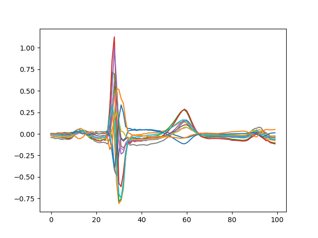
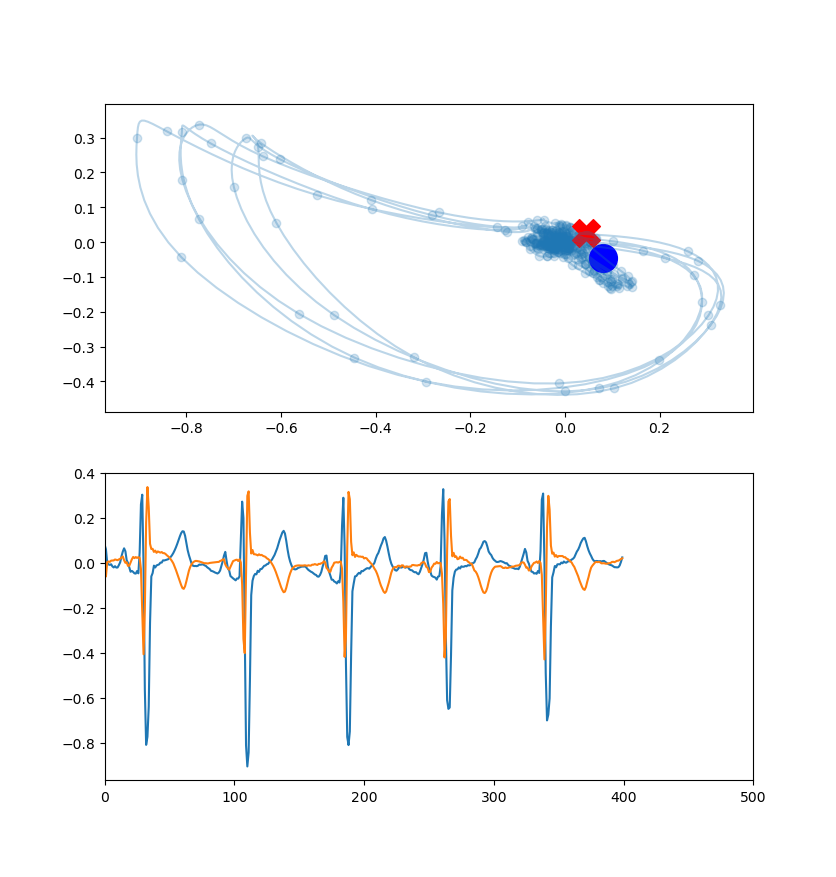
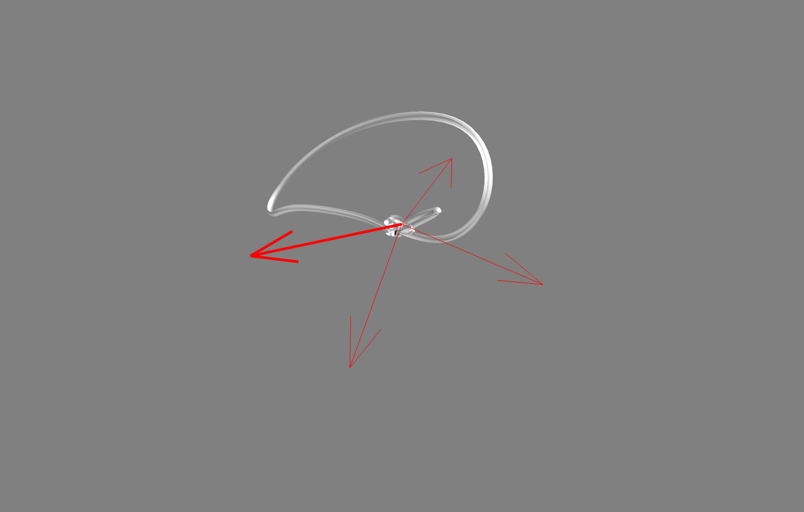
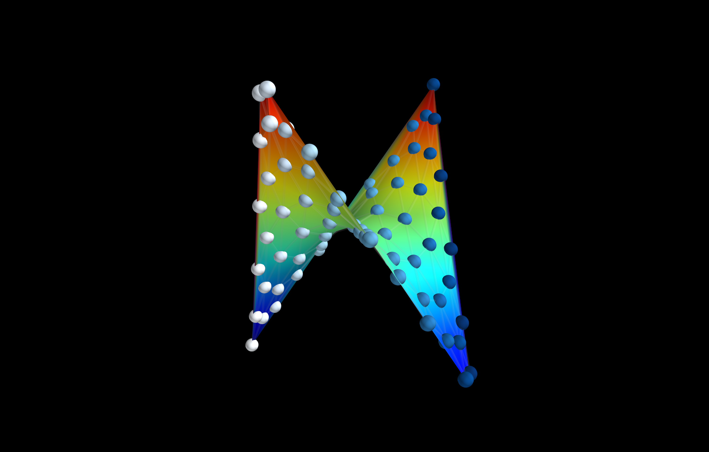

# ECG Tensors and Visualization
Author: Vineet Tiruvadi 2019

A fun library I made during my IM rotation at Grady/Emory. It's meant to help visualize the learning process with ECGs, particularly with an emphasis on seeing the traditional ECG timetraces in a more modern, dynamical systems perspective. Maybe this will rely on other control theory-related repos I've got setup...

## Dataset
We'll use the PhysioNet.org STAFFIII database.

## Calculating augmented leads
The first step is to take the 9 channels from the STAFFIII database and compute our augmented leads. It's pretty straightforward to do, so we do it.

## Phase portrait
ECGs are multiple measurements of a single underlying process: the heart beating.
As it beats, it exhibits *patterns* that cardiologists have spent a lot of time mapping in detail.
Those details, while important, can likely be simplified greatly by looking at the data in a different way.
The engineering and physics fields give us a great way to view them: the phase space.
In this space, we can see how variables relate to each other and how they change with respect to each other.
With a very simple reframing of the data, we can see patterns emerge much more obviously.

An example of the phase space between channel V1 and V2 is displayed below

## 3D Phase portrait
Why not plot it in 3d? That's much cooler

## Mechanical-Electrical (from scratch)
The next step is to build up a cardiomyocyte syncitium from scratch and try to get it to generate electrical signals in a forward model

